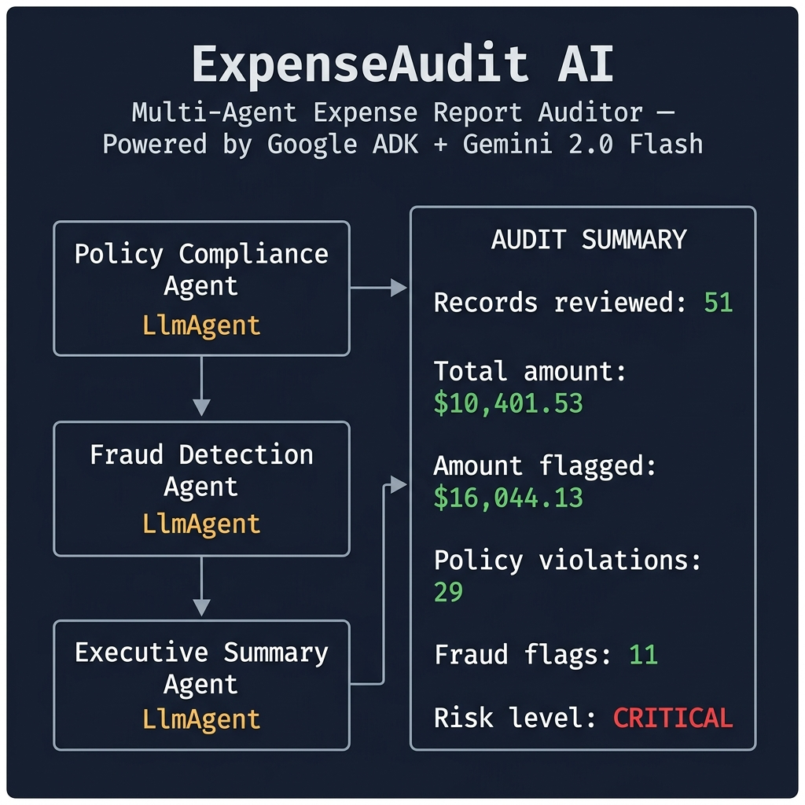

# ExpenseAudit AI 🔍

<p align="center">
  
</p>

> **Multi-agent expense-report auditing powered by Google ADK + Gemini 2.0 Flash**


[](https://python.org)
[](https://google.github.io/adk-docs/)
[](https://fastapi.tiangolo.com)
[](LICENSE)

**Kaggle × Google AI Agents: Intensive Vibe Coding Capstone** — *Track: Agents for Business*

📌 **[Full Architecture Diagram → docs/architecture.md](docs/architecture.md)**

---

## The Problem

Finance teams manually review employee expense reports line by line against spend policies, and try to spot fraud patterns across hundreds of monthly submissions.

This is **slow, reviewer-dependent, and expensive** — every missed violation is direct cost leakage, and every hour spent on manual review is an hour not spent on higher-value work.

## The Solution

ExpenseAudit AI orchestrates **three specialised LLM agents** — each doing one job well — through a `SequentialAgent` pipeline:

```
Expense Batch (JSON)
        ↓
┌───────────────────────────────────────────────────────┐
│           Orchestrator (SequentialAgent)               │
│                                                        │
│  ① Policy-Compliance Agent (LlmAgent)                 │
│     └─ tool: run_policy_check() [deterministic]       │
│                     ↓                                  │
│  ② Fraud-Pattern Agent (LlmAgent)                     │
│     └─ tool: run_fraud_scan() [deterministic]         │
│                     ↓                                  │
│  ③ Summary & Report Agent (LlmAgent)                  │
│     └─ tool: run_summary_build() [deterministic]      │
└───────────────────────────────────────────────────────┘
        ↓
Finance-Ready Executive Report
        ↓ (optional, opt-in)
Google Drive via MCPToolset
```

**Core design principle:** every dollar-amount decision (over limit? duplicate? threshold-skirting?) is made by **tested, deterministic Python code — never by the LLM guessing at arithmetic**. The LLM agents call these tools, then explain the results in clear, decision-oriented language a non-technical Finance Director can act on in five minutes.

---

## Course Concepts Demonstrated

| Concept | Evidence |
|---|---|
| **Multi-agent system (ADK)** | 3 `LlmAgent`s under a `SequentialAgent` in `expense_audit/agents/` |
| **MCP Server** | Real `MCPToolset` for Google Drive report export in `expense_audit/mcp/` |
| **Security features** | HMAC pseudonymisation, redacted logging, env-var-only secrets, append-only audit trail, IP rate limiting |
| **Deployability** | FastAPI service (`api/main.py`) + Dockerfile (Python 3.12-slim) + `docker-compose.yml` |
| **Agent Skills (CLI)** | Standalone `cli.py` — schedulable batch-audit tool with CI-friendly exit codes |

---

## Policy Rules Enforced

| Rule | Threshold | Severity |
|---|---|---|
| Meals spend limit | $50 (× dept multiplier) | HIGH |
| Travel spend limit | $1,500 (× dept multiplier) | HIGH |
| Lodging spend limit | $300 (× dept multiplier) | HIGH |
| Office Supplies limit | $200 (× dept multiplier) | HIGH |
| Client Entertainment limit | $250 (× dept multiplier) | HIGH |
| Software/Subscriptions limit | $100 (× dept multiplier) | HIGH |
| Manager pre-approval required | ≥ $500 | HIGH |
| Receipt required | Always | HIGH |
| Weekend expense flag | Saturday or Sunday | LOW |

**Department multipliers:** e.g. `{"Sales": 1.5, "Marketing": 1.2}` — departments not listed default to 1.0×.

## Fraud Patterns Detected

| Pattern | Risk Score |
|---|---|
| Duplicate / near-duplicate submission | 9 / 10 |
| Vendor anomaly (shell-company patterns) | 8 / 10 |
| Split transaction (same-day fragmentation to avoid approval threshold) | 8 / 10 |
| Threshold-skirting ($450–$499.99 band) | 4–7 / 10 |
| Statistical outlier (z-score > 2.5 vs employee's own baseline, leave-one-out) | 6 / 10 |
| Round-number padding (≥ 3 exact amounts) | 5 / 10 |

---

## Quick Start

### Prerequisites
- Python 3.10+
- `pip` (or [`uv`](https://github.com/astral-sh/uv))
- A `GOOGLE_API_KEY` for the full LLM pipeline (free at [aistudio.google.com](https://aistudio.google.com/app/apikey))
- **Docker 24+** *(optional)* — for the containerised deployment path

### 1 — Clone & install

```bash
git clone https://github.com/YOUR_USERNAME/expense-audit-ai.git
cd expense-audit-ai

python -m venv .venv
# Windows
.venv\Scripts\activate
# macOS / Linux
source .venv/bin/activate

pip install -e ".[test]"
```

### 2 — Configure

```bash
cp .env.example .env
# Edit .env and set:
#   GOOGLE_API_KEY=your_key_here
#   PSEUDONYM_SALT=any_random_secret
#     Generate with: python -c "import secrets; print(secrets.token_hex(32))"
```

### 3 — Generate sample data

```bash
python data/generate_synthetic.py
# → data/sample_batch.json (51 records with seeded fraud patterns)
```

### 4 — Run the CLI (deterministic — no API key needed)

```bash
python cli.py --input data/sample_batch.json --mode deterministic
```

### 5 — Run the CLI (full LLM pipeline)

```bash
python cli.py --input data/sample_batch.json --mode full
```

### 6 — Start the API server (local / venv)

```bash
uvicorn api.main:app --reload
# → http://localhost:8000/docs (Swagger UI)
```

### 7 — Run tests

```bash
pytest tests/ -v
# Expected: 89 tests pass, 7 deprecation warnings (upstream ADK/httpx), 0 failures
```

---

## API Reference

| Method | Endpoint | Description |
|---|---|---|
| `GET` | `/` | → Redirect to `/docs` |
| `GET` | `/health` | Liveness check + capability flags |
| `POST` | `/audit/deterministic` | Engines only — fast, no API key |
| `POST` | `/audit/full` | Full multi-agent LLM pipeline (rate-limited: 10 req/60 s per IP) |
| `GET` | `/audit/trail` | Last N audit trail entries (no PII) |

**Example request:**

```bash
curl -s -X POST http://localhost:8000/audit/deterministic \
  -H "Content-Type: application/json" \
  -d '{
    "submitted_by": "demo",
    "records": [{
      "expense_id": "EXP-001",
      "employee_id": "EMP-001",
      "employee_name": "Jane Smith",
      "submission_date": "2026-06-10",
      "expense_date": "2026-06-08",
      "category": "Meals",
      "vendor": "Fancy Restaurant",
      "amount": 95.00,
      "description": "Team lunch",
      "has_receipt": true,
      "manager_approved": false,
      "department": "Engineering"
    }]
  }' | python -m json.tool
```

---

## 🐳 Docker

### Option A — docker build / docker run

```bash
# 1. Build the image (Python 3.12-slim, two-stage — lean production image)
docker build -t expense-audit-ai .

# 2. Run — load secrets from .env (never hard-code keys in shell history)
docker run -p 8000:8000 --env-file .env expense-audit-ai

# 3. Verify the service is healthy
curl http://localhost:8000/health
# Expected: {"status": "ok", "version": "1.0.0", "llm_enabled": true, ...}
```

> **Why `--env-file .env` instead of `-e GOOGLE_API_KEY=...`?**
> Inline `-e` flags appear in process listings (`ps aux`) and shell history.
> `--env-file` passes secrets through the Docker daemon — never visible in `ps`.

### Option B — Docker Compose (recommended for development)

```bash
docker compose up          # builds if needed, starts with .env loaded
docker compose up --build  # force rebuild
docker compose up -d       # detached / background
docker compose logs -f api # stream logs
docker compose down        # stop and remove containers
```

`docker-compose.yml` provides:
- `env_file: .env` — secrets loaded automatically from your `.env`
- Named volume `audit_data` — audit trail persists across container restarts
- Built-in HEALTHCHECK matching the Dockerfile

### Verifying the containerised service

```bash
curl http://localhost:8000/health
curl -s -X POST http://localhost:8000/audit/deterministic \
  -H "Content-Type: application/json" \
  -d '{"submitted_by": "docker_test", "records": [{"expense_id":"EXP-001","employee_id":"EMP-001","employee_name":"Test","submission_date":"2026-06-10","expense_date":"2026-06-08","category":"Meals","vendor":"Cafe","amount":95.00,"description":"Lunch","has_receipt":true,"manager_approved":false,"department":"Engineering"}]}'
```

---

## Sample Results

Running `python cli.py --input data/sample_batch.json --mode deterministic` against the current 51-record synthetic batch produces:

```
Records reviewed    : 51
Total batch amount  : $10,401.53
Amount flagged      : $16,044.13
Policy violations   : 29
Fraud flags         : 11
Risk level          : CRITICAL
```

**Top fraud flags (by risk score):**

| Risk | Type | Finding |
|---|---|---|
| 9/10 | `duplicate_submission` | EXP-0033, EXP-0034 — $62.49 Software/Subscriptions submitted twice, 0 days apart |
| 9/10 | `duplicate_submission` | EXP-0031, EXP-0032 — $64.49 Software/Subscriptions submitted twice, 0 days apart |
| 8/10 | `vendor_anomaly` | EXP-0040, EXP-0041 — Cash Payment + Misc Services LLC |
| 8/10 | `split_transaction` | EXP-0038, EXP-0039 — $491.23 + $472.02 Client Entertainment same day, combined $963.25 |
| 8/10 | `split_transaction` | EXP-0042, EXP-0043 — 2× $280 Travel same day, combined $560 |
| 6/10 | `statistical_outlier` | EXP-0051 — $480 Meals, z-score +148 vs employee baseline of $30.90 |

**Top policy violations:**

| Expense | Rule | Detail |
|---|---|---|
| EXP-0030 | `category_limit_exceeded` | $848.97 Client Entertainment exceeds $300 (Marketing 1.2×) by $548.97 |
| EXP-0028 | `approval_threshold_exceeded` | $694.40 Client Entertainment, no manager approval |
| EXP-0029 | `category_limit_exceeded` | $690.11 Client Entertainment exceeds $375 (Sales 1.5×) by $315.11 |

*Numbers from a seeded synthetic batch — re-run `python data/generate_synthetic.py` then `cli.py` to regenerate.*

---

## 🔐 Security Design

| Control | Implementation |
|---|---|
| **No hardcoded secrets** | All credentials via env vars / `.env` — gitignored |
| **Employee PII redacted** | Names never written to logs; IDs HMAC-pseudonymised (SHA-256 + salt) |
| **PII salt warning** | `pseudonymize.py` emits a loud `[SECURITY]` WARNING if `PSEUDONYM_SALT` is absent **or** left as the `.env.example` placeholder |
| **Append-only audit trail** | Batch-level metadata only (`batch_id`, counts, timestamp) — never individual expense data |
| **LLM grounding** | Every financial figure comes from deterministic tools, not LLM inference |
| **Rate limiting** | `/audit/full` enforces a sliding-window IP-based limit (10 req / 60 s) to protect the paid Gemini API |

### Secret scan (last run: Day 4)

| Pattern | Result |
|---|---|
| `api_key=` | ❌ No matches outside placeholder comments |
| `AIza` | ❌ No matches in tracked files (`.env` gitignored) |
| `sk-` | ❌ Only occurs inside English words in docstrings |

---

## 📊 Google Drive MCP Export

The report agent optionally uploads the final audit report JSON to Google Drive via an `MCPToolset` connection. This is **opt-in** — the system runs fully without it.

### Enable Drive export (manual steps)

1. Create a Google Cloud service account with Drive API enabled and download the JSON key.
2. Set in `.env`: `GOOGLE_DRIVE_MCP_CREDENTIALS=/absolute/path/to/credentials.json`
3. Per-request opt-in via the API: `{"enable_drive_export": true, ...}`
4. Or at agent creation: `create_report_agent(enable_drive_export=True)`

> **Status:** Code path implemented and guarded in `expense_audit/mcp/drive_export.py` and `expense_audit/agents/report_agent.py`. Not live-tested in this submission (no Drive MCP server credentials configured). The code path runs without error when credentials are provided.

---

## Project Structure

```
expense-audit-ai/
├── expense_audit/
│   ├── config.py              # Pydantic-settings env-var config
│   ├── models.py              # Pydantic data models (ExpenseRecord, PolicyResult, etc.)
│   ├── engine/
│   │   ├── policy_engine.py   # 4 policy rules (deterministic, no LLM)
│   │   └── fraud_engine.py    # 6 fraud detectors (deterministic, no LLM)
│   ├── agents/
│   │   ├── tools.py           # FunctionTool wrappers + run_summary_build
│   │   ├── policy_agent.py    # LlmAgent: compliance narrative
│   │   ├── fraud_agent.py     # LlmAgent: fraud analysis narrative
│   │   ├── report_agent.py    # LlmAgent: executive summary + Drive export opt-in
│   │   └── orchestrator.py    # SequentialAgent pipeline + run_pipeline()
│   ├── mcp/
│   │   └── drive_export.py    # MCPToolset for Google Drive
│   └── security/
│       ├── pseudonymize.py    # HMAC-SHA256 employee-ID pseudonymisation
│       └── audit_trail.py     # Append-only JSONL audit log
├── api/
│   └── main.py                # FastAPI service (rate limiting, retry, timeout)
├── docs/
│   ├── architecture.md        # Full agent-flow Mermaid diagrams
│   └── DEMO_SCRIPT.md         # Video demo script
├── cli.py                     # Agent skill — schedulable CLI, CI exit codes
├── data/
│   ├── generate_synthetic.py  # 51-record seeded batch generator
│   └── sample_batch.json      # Generated test batch (w/ dept multipliers)
├── tests/
│   ├── conftest.py
│   ├── test_audit_logic.py    # 47+ unit + agent-wiring tests
│   ├── test_api.py            # FastAPI endpoint tests (11 tests)
│   ├── test_fraud_engine.py   # Fraud detector tests (13 tests)
│   └── test_policy_engine.py  # Policy rule tests (11 tests)
├── Dockerfile                 # Python 3.12-slim, two-stage build
├── docker-compose.yml         # Compose with env_file + persistent volume
├── requirements.txt           # Runtime deps for Docker install
├── pyproject.toml
└── .env.example
```

---

## Expense Record Schema

```json
{
  "expense_id":       "EXP-0001",
  "employee_id":      "EMP-001",
  "employee_name":    "Alice Chen",
  "submission_date":  "2026-06-10",
  "expense_date":     "2026-06-08",
  "category":         "Meals",
  "vendor":           "Cafe Central",
  "amount":           42.50,
  "description":      "Team lunch",
  "has_receipt":      true,
  "manager_approved": false,
  "department":       "Engineering"
}
```

Supported categories: `Meals`, `Travel`, `Lodging`, `Office Supplies`, `Client Entertainment`, `Software/Subscriptions`

---

## 🎓 Original Work Statement

This project was built entirely by me (Mohammed Imad Thotan) during the Kaggle × Google AI Agents Intensive Capstone (July 2026), solo submission.

All code was written from scratch for this capstone:
- No third-party expense-audit libraries were used.
- The deterministic engines (policy rules, fraud detectors) are original Python implementations.
- The multi-agent pipeline design, security architecture, and CLI are original work.
- Google ADK, FastAPI, Pydantic, and python-dotenv are used as intended third-party frameworks.

The synthetic data generator uses the [Faker](https://faker.readthedocs.io/) library for realistic names and company names; all fraud-pattern seeds are hand-crafted to exercise specific detection paths.

---

## Author

**Mohammed Imad Thotan** — Solo submission, Kaggle × Google AI Agents Capstone 2026

🔗 **GitHub:** [github.com/Mohammedimad01/expense-audit-ai](https://github.com/Mohammedimad01/expense-audit-ai)

---

## License

MIT — see [LICENSE](LICENSE) for details.
