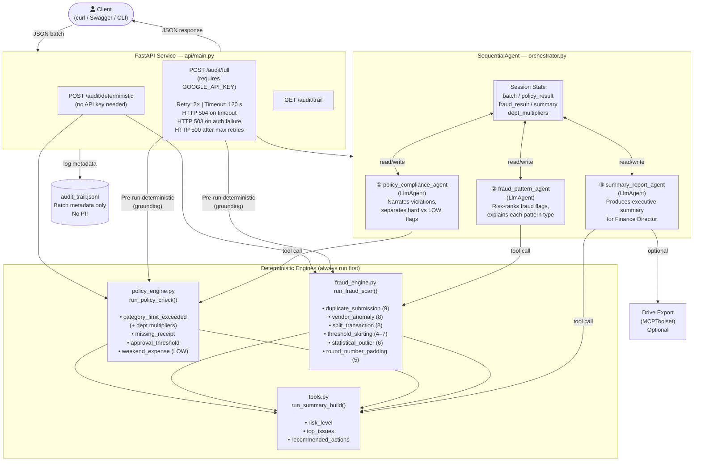
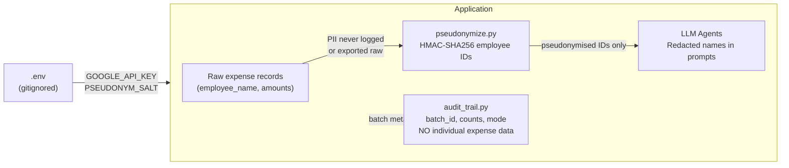
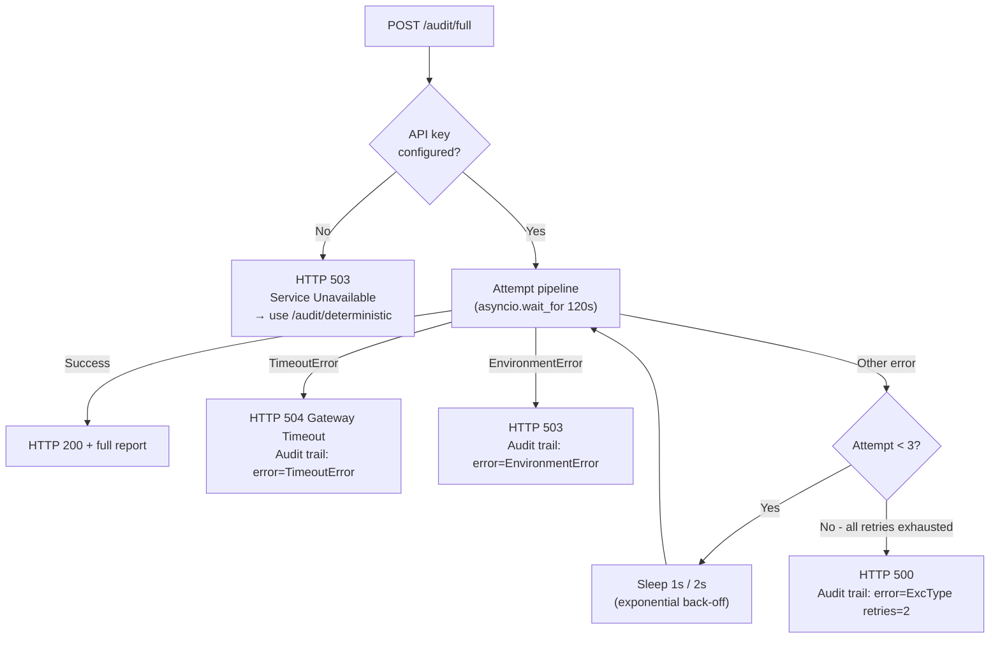

# ExpenseAudit AI — Architecture

> **Kaggle × Google AI Agents Capstone 2026 — Track: Agents for Business**

---

## Core Design Principle

Every dollar-amount decision (over limit? duplicate? statistical outlier?) is made by **tested, deterministic Python code — never by an LLM guessing at arithmetic**.

The LLM agents call those tools, then explain the results in clear, decision-oriented language a non-technical Finance Director can act on in five minutes.

---

## Full Agent Pipeline Flow

---

## Session State — Data Flow

| Field | Written by | Read by |
|---|---|---|
| `batch` | Orchestrator (initial) | policy_agent, fraud_agent |
| `batch_id` | Orchestrator (initial) | report_agent |
| `department_multipliers` | Orchestrator (initial) | policy_agent (via tool) |
| `policy_result` | Orchestrator pre-run → policy_agent tool | fraud_agent, report_agent |
| `fraud_result` | Orchestrator pre-run → fraud_agent tool | report_agent |
| `summary` | Orchestrator pre-run → report_agent tool | (returned to caller) |

> **Grounding strategy:** The orchestrator runs all three deterministic engines *before* launching the LLM agents and injects results into `initial_state`. This means the LLM agents always narrate pre-computed, test-verified numbers — they cannot hallucinate dollar amounts or counts.

---

## Technology Stack

| Layer | Technology |
|---|---|
| Agent orchestration | [Google ADK](https://google.github.io/adk-docs/) `SequentialAgent` + `LlmAgent` |
| LLM model | Gemini 2.0 Flash (`gemini-2.0-flash`) |
| Deterministic engines | Pure Python (`statistics`, `datetime` stdlib) |
| API service | FastAPI 0.115 + Uvicorn |
| Data validation | Pydantic v2 |
| MCP integration | `google.adk.tools.mcp_tool.MCPToolset` (Google Drive export) |
| Security | HMAC pseudonymisation + append-only JSONL audit trail |
| Testing | pytest 9+ |

---

## Policy Rules (v2 — Day 2 additions)

| Rule | Threshold | Severity |
|---|---|---|
| Meals spend limit | $50 (× dept multiplier) | HIGH |
| Travel spend limit | $1,500 (× dept multiplier) | HIGH |
| Lodging spend limit | $300 (× dept multiplier) | HIGH |
| Office Supplies limit | $200 (× dept multiplier) | HIGH |
| Client Entertainment limit | $250 (× dept multiplier) | HIGH |
| Software/Subscriptions limit | $100 (× dept multiplier) | HIGH |
| Manager pre-approval required | ≥ $500 | HIGH |
| Receipt required | Always | HIGH |
| **Weekend expense flag** *(Day 2)* | Saturday or Sunday | **LOW** |

**Department multipliers (configurable):** e.g. `{"Sales": 1.5, "Marketing": 1.2}` — departments not listed default to 1.0×.

---

## Fraud Detection Rules (v2 — Day 2 additions)

| Pattern | Risk Score | Detection Method |
|---|---|---|
| Duplicate / near-duplicate submission | 9/10 | Exact match on (employee, category, amount, vendor, date) |
| Vendor anomaly (shell-company patterns) | 8/10 | Keyword match against known suspicious patterns |
| **Split transaction** *(Day 2)* | 8/10 | Group by (employee, category, date); sum < threshold individually but ≥ threshold combined |
| Threshold skirting ($450–$499.99 band) | 4–7/10 | Amount range check; risk scales with count |
| **Statistical outlier** *(Day 2)* | 6/10 | Leave-one-out z-score > 2.5 vs. employee's own baseline (≥ 4 expenses required) |
| Round-number padding (≥ 3 exact amounts) | 5/10 | Integer-amount frequency per employee |

---

## Security Architecture

- **No hardcoded secrets** — all credentials via environment variables
- **Employee PII redacted** — names stripped from all API responses; employee IDs HMAC-pseudonymised in exports
- **Append-only audit trail** — batch-level metadata only; individual expense data never written
- **LLM grounding** — financial figures come from deterministic tools, not LLM inference

---

## Error Handling — `/audit/full`

---

*Generated for Kaggle × Google AI Agents Capstone 2026 — Mohammed Imad Thotan*
